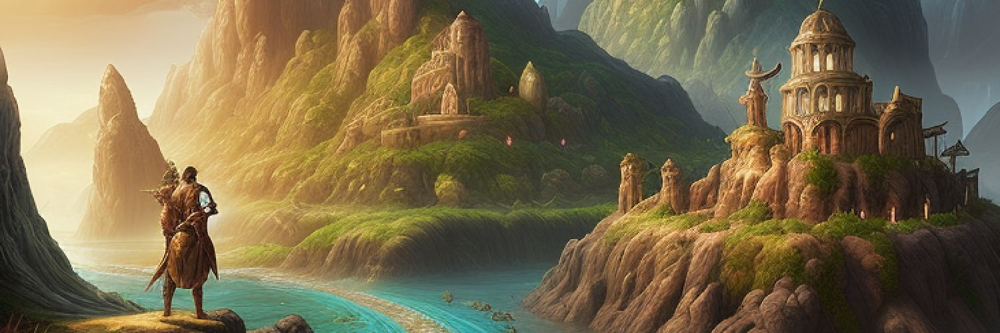

<div class="typing-effect-container">
    <div style="font-size: 16px; display: flex; justify-content: center; align-items: center; height: 100px; overflow-y: auto; background: var(--highlight); border-radius: 8px; margin: 1rem 0; font-family: var(--codeFont);">
        <div id="typing-effect-1">
            <span id="htmlText-1"></span>
            <span class="cursor">&nbsp;</span>
        </div>
    </div>
</div>

<style>
    .cursor {
        border-left: 2px solid var(--dark);
        animation: blink 0.5s infinite;
        margin-left: 2px;
    }

    @keyframes blink {
        50% {
            border-color: transparent;
        }
    }
</style>


<div style="text-align: center; margin: 20px 0;"><a href="https://odyssey.daviddiener.de" style="display: inline-block; padding: 10px 20px; background-color: var(--secondary); color: white; text-decoration: none; border-radius: 5px; font-weight: bold;" target="_blank">Start your Odyssey now</a></div>

Ever since my first web development course in university, I’ve been tinkering with projects, mostly using the MEAN stack. Since I’m also a game developer, I eventually tried to combine both. The result is Odyssey: a web app that’s part Multi-User Dungeon (MUD), part simulator, and part RPG. It’s a long-term project that I keep adding to in my free time.

## Combining WebDev and Gaming
Odyssey isn't a standard website. It’s a text-heavy, fantastical world where you can create multiple characters and explore a procedurally generated landscape. I wanted to see if I could take the depth of a classic MUD and bring it into a modern web environment.

## Building the World
The map is probably the most important part of the project. Instead of a fixed world, I used a Simplex Noise algorithm to generate heightmaps. It assigns a value between 0.0 and 1.0 to every coordinate, which determines things like the biome and where cities are placed. This makes the world feel much more dynamic than a traditional static RPG map. I later even built a standalone [[FWMG|Fantasy World Map Generator]] to visualize these kinds of worlds.

## The Tech Stack
Odyssey is split into two separate projects: a backend that handles the logic and a frontend to display everything.

### Odyssey Frontend
The frontend uses **Angular** for the main UI and **Phaser.js** for the world map. Angular handles the data and state, while Phaser takes care of rendering the map and making it interactive.


### Odyssey Backend
The backend is built with **Express.js**. It acts as a REST API, serving up data for regions, cities, and characters. It also handles the boring but necessary stuff like user authentication and secure sessions.

#### Generating Regions
The world generates coordinates in a spiral pattern starting from (0,0). I actually ended up with two functions for this: `spiralOut` and `spiralOutPerformance`.

- **spiralOut**: This is the basic version. It works fine for small maps, but because it recalculates from (0,0) every time, it gets slow as the world grows.
- **spiralOutPerformance**: I wrote this to fix the scaling issue. It remembers the last coordinate and direction, so it can just calculate the next step instantly without starting over.

```typescript
export let x: number = 0;
export let y: number = 0;
export let delta: number[] | null = null;

export function setDeltaNull(): void {
  delta = null;
}

export function spiralOut(iterations: number): number[] {
  x = 0;
  y = 0;
  delta = [0, -1];

  for (let i: number = 0; i <= iterations; i++) {
    if (
      x === y ||
      (x < 0 && x === -y) ||
      (x > 0 && x === 1 - y)
    ) {
      // change direction
      delta = [-delta[1], delta[0]];
    }

    x += delta[0];
    y += delta[1];
  }
  x -= delta[0];
  y -= delta[1];

  return [x, y];
}

export function spiralOutPerformance(): number[] {
  if(delta) {
    x += delta[0]
    y += delta[1]
  }

  if (
    x === y ||
    (x < 0 && x === -y) ||
    (x > 0 && x === 1 - y)
  ) {
    // change direction
    if(delta) delta = [-delta[1], delta[0]];
  }

  return [x, y];
}
```

Once a coordinate is generated, the Simplex Noise algorithm gives it a height value. That value then determines everything from the biome type to whether a city should spawn there.

#### Pathfinding
For character movement, I used the A* algorithm via the [PathFinding.js](https://github.com/qiao/PathFinding.js/) library. It calculates the most efficient route between two regions while avoiding water.

```typescript
import { RegionModel, Region } from '../components/regions/regionModel';
import PF from 'pathfinding';

export default function findPath(startRegion: Region, endRegion: Region, clearance: number): Promise<Region[] | void> {
  const promise = new Promise<Region[]>((resolve, reject) => {
    // Calculate Grid Borders
    const topLeftX = startRegion.x < endRegion.x ? startRegion.x : endRegion.x;
    const topLeftY = startRegion.y > endRegion.y ? startRegion.y : endRegion.y;

    const bottomRightX = startRegion.x > endRegion.x ? startRegion.x : endRegion.x;
    const bottomRightY = startRegion.y < endRegion.y ? startRegion.y : endRegion.y;

    // Fetch Regions
    RegionModel.find({
      x: { $gte: topLeftX - clearance, $lte: bottomRightX + clearance },
      y: { $gte: bottomRightY - clearance, $lte: topLeftY + clearance }
    }, 'x y type', { sort: { y: 1, x: 1 } })
      .then(regions => {
        // Generate Search Matrix
        const griddMatrix: Region[][] = [];
        let pointerYWorld = regions[0].y;
        let row: Region[] = [];
        regions.forEach(region => {
          if (pointerYWorld !== region.y) {
            griddMatrix.push(row);
            row = [];
          }
          row.push(region);
          pointerYWorld = region.y;
        });
        griddMatrix.push(row);

        // Find our Start and Endpoint in the gridmatrix
        const startRegionY = griddMatrix.findIndex(s => s.some(o => o._id.toString() === startRegion._id.toString()));
        const startRegionX = griddMatrix[startRegionY].findIndex(s => s._id.toString() === startRegion._id.toString());
        const endRegionY = griddMatrix.findIndex(s => s.some(o => o._id.toString() === endRegion._id.toString()));
        const endRegionX = griddMatrix[endRegionY].findIndex(s => s._id.toString() === endRegion._id.toString());

        // Generate a binary matrix to define walkable tiles
        const binaryMatrix = griddMatrix.map(x => x.map(r => r.type !== 'water' ? 0 : 1));

        // A* Path Searching
        const grid = new PF.Grid(binaryMatrix);
        const finder = new PF.AStarFinder();
        const path = finder.findPath(
          startRegionX,
          startRegionY,
          endRegionX,
          endRegionY,
          grid
        );

        // This is the way
        const stations: Region[] = [];
        path.forEach(coordinate => {
          stations.push(griddMatrix[coordinate[1]][coordinate[0]]);
        });
        return resolve(stations);
        });
      })
      .catch(err => {
        console.log(err)
      })
      
  return promise;
}
```

## Check it out
Odyssey is still very much a work in progress, but the core systems are there. If you want to see it in action, you can [try it out here](https://odyssey.daviddiener.de).
